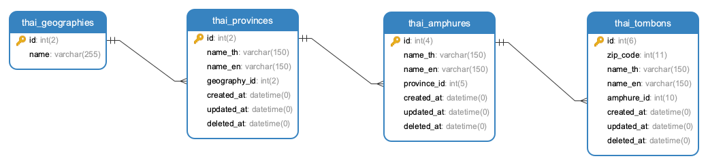

## ข้อมูลจังหวัด อำเภอ ตำบล ของประเทศไทย

### ข้อมูลประกอบด้วยรูปแบบ
- csv
- json
- sql
- xlsx
- xml

### API JSON ไฟล์สำหรับใช้งาน
- (ทั้งหมด) https://raw.githubusercontent.com/kongvut/thai-province-data/master/api_province_with_amphure_tombon.json
- (จังหวัด) https://raw.githubusercontent.com/kongvut/thai-province-data/master/api_province.json
- (อำเภอ) https://raw.githubusercontent.com/kongvut/thai-province-data/master/api_amphure.json
- (ตำบล) https://raw.githubusercontent.com/kongvut/thai-province-data/master/api_tombon.json

### Demo Fetch API
https://codesandbox.io/s/thailand-province-demo-api-k3st7
