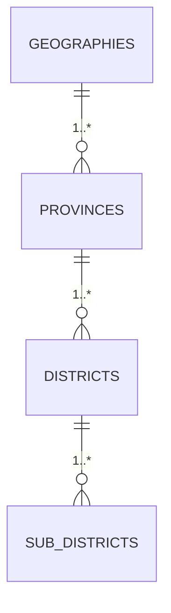

# Thai Province Data

[](https://github.com/kongvut/thai-province-data/stargazers)
[](https://github.com/kongvut/thai-province-data/network)
[](LICENSE)

ชุดข้อมูล **จังหวัด (Province), อำเภอ (District), ตำบล (Sub-district)** ของประเทศไทย  
รองรับหลายรูปแบบ (**CSV, JSON, SQL, XLSX, XML**) และมี **API JSON** ให้เรียกใช้งานได้ทันที

> 📌 ตั้งแต่ **v2** มีการเปลี่ยนโครงสร้างและการตั้งชื่อ ดูรายละเอียดที่ [CHANGELOG.md](CHANGELOG.md)

---

## 📚 Table of Contents
- [โครงสร้างโปรเจกต์](#-โครงสร้างโปรเจกต์)
- [รูปแบบข้อมูลและสคีมา](#-รูปแบบข้อมูลและสคีมา)
- [ไฟล์ API พร้อมใช้งาน](#-ไฟล์-api-พร้อมใช้งาน)
- [การใช้งานแบบรวดเร็ว](#-การใช้งานแบบรวดเร็ว)
- [การใช้งานด้วยโค้ด](#-การใช้งานด้วยโค้ด)
- [สคริปต์ & Automation](#-สคริปต์--automation)
- [Diagram](#-diagram)
- [Contributing](#-contributing)
- [Documentation](#-documentation)
- [Changelogs](#-changelogs)
- [License](#-license)

---

## 📂 โครงสร้างโปรเจกต์

```
├── api
│   ├── latest
│   │   ├── district.json
│   │   ├── province_with_district_and_sub_district.json
│   │   ├── province.json
│   │   ├── sub_district_with_district_and_province.json
│   │   └── sub_district.json
│   └── v1
│       ├── amphure.json
│       ├── province_with_amphure_tambon.json
│       ├── province.json
│       └── tambon.json
├── data
│   ├── raw/        # ข้อมูลต้นฉบับ
│   └── spec/       # JSON Schema สำหรับ validate
├── docs            # diagram, schema, readme
├── formats         # export ไฟล์ csv/json/sql/xlsx/xml
├── scripts         # pipeline สคริปต์ (validate, export, api)
├── CHANGELOG.md
├── CONTRIBUTING.md
├── LICENSE
└── README.md
```

**Highlights v2**
- `amphure` → `district`, `tambon` → `sub_district`
- ลบ prefix `thai_` ในชื่อ dataset
- เพิ่ม spec schema ใน `data/spec/*.json`
- pipeline รันง่ายด้วย `scripts/make.py`

---

## 🧾 รูปแบบข้อมูลและสคีมา
- **geography.json** → `id`, `name`
- **province.json** → `id`, `name_th`, `name_en`, `geography_id`, timestamps
- **district.json** → `id`, `name_th`, `name_en`, `province_id`, timestamps
- **sub_district.json** → `id`, `zip_code`, `name_th`, `name_en`, `district_id`, `lat`, `long`, timestamps

ข้อมูลต้นทางอยู่ใน `data/raw/*.json` → export ได้หลายไฟล์ใน `formats/*`

---

## 🔌 ไฟล์ API พร้อมใช้งาน

ไฟล์ใน `api/latest/` สามารถเรียกใช้งานตรงจาก GitHub Raw:

- `province.json`
- `district.json`
- `sub_district.json`
- `province_with_district_and_sub_district.json`
- `sub_district_with_district_and_province.json`

**ตัวอย่าง Raw URL**
```
https://raw.githubusercontent.com/kongvut/thai-province-data/refs/heads/master/api/latest/province.json
```

---

## ⚡ การใช้งานแบบรวดเร็ว

```bash
# ดูจังหวัดแรก ๆ
curl -s https://raw.githubusercontent.com/kongvut/thai-province-data/refs/heads/master/api/latest/province.json | jq '.[0:3]'
```

```bash
# clone repo และรัน pipeline
git clone https://github.com/kongvut/thai-province-data.git
cd thai-province-data
python3 -m venv .venv && source .venv/bin/activate
pip install -U pandas openpyxl
python3 scripts/make.py
```

---

## 💻 การใช้งานด้วยโค้ด

### Python
```python
import requests

url = "https://raw.githubusercontent.com/kongvut/thai-province-data/refs/heads/master/api/latest/province.json"
provinces = requests.get(url).json()

print(provinces[0])
# {'id': 1, 'name_th': 'กรุงเทพมหานคร', 'name_en': 'Bangkok', 'geography_id': 2, ...}
```

### Node.js
```js
import fetch from "node-fetch";

const url = "https://raw.githubusercontent.com/kongvut/thai-province-data/refs/heads/master/api/latest/district.json";
const res = await fetch(url);
const districts = await res.json();

console.log(districts[0]);
// { id: 1001, name_th: 'เขตพระนคร', name_en: 'Khet Phra Nakhon', province_id: 1, ... }
```

---

## 🧪 สคริปต์ & Automation

- `scripts/0_validate_data.py` → validate schema + FK + format
- `scripts/1_export_file_format.py --overwrite` → export CSV/JSON/SQL/XLSX/XML
- `scripts/2_export_api.py --overwrite` → build API JSON
- `scripts/make.py` → pipeline รวมทุกขั้นตอน

อ่านรายละเอียดเพิ่มเติม [scripts/readme.md](scripts/readme.md)

---

## 🧭 Diagram

ดูแผนภาพ ERD ที่ [docs/diagram.md](docs/diagram.md)
ตัวอย่าง Mermaid:



---

## 🤝 Contributing
- ยินดีรับ PR ทั้งแก้ไขข้อมูล เพิ่ม dataset ปรับ docs หรือเพิ่ม export format
- โปรดอ่าน [CONTRIBUTING.md](CONTRIBUTING.md) ก่อนส่ง PR

---

## 📃 Documentation

Documentation เอกสารประกอบสำหรับการใช้งานและการพัฒนาโปรเจกต์ `thai-province-data` [docs/readme.md](docs/readme.md)

---

## 📜 Changelogs

โปรเจกต์นี้มีการอัปเดตและปรับปรุงอย่างต่อเนื่อง  
สามารถติดตามรายละเอียดการเปลี่ยนแปลงทั้งหมดได้ที่ [CHANGELOG.md](CHANGELOG.md)

For more details, please see the [CHANGELOG.md](https://github.com/kongvut/thai-province-data/blob/master/CHANGELOG.md)

---

## 📄 License
[MIT License](LICENSE) © 2025 Kongvut Sangkla
