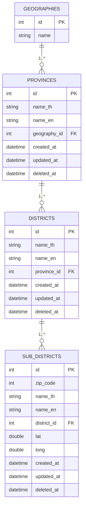
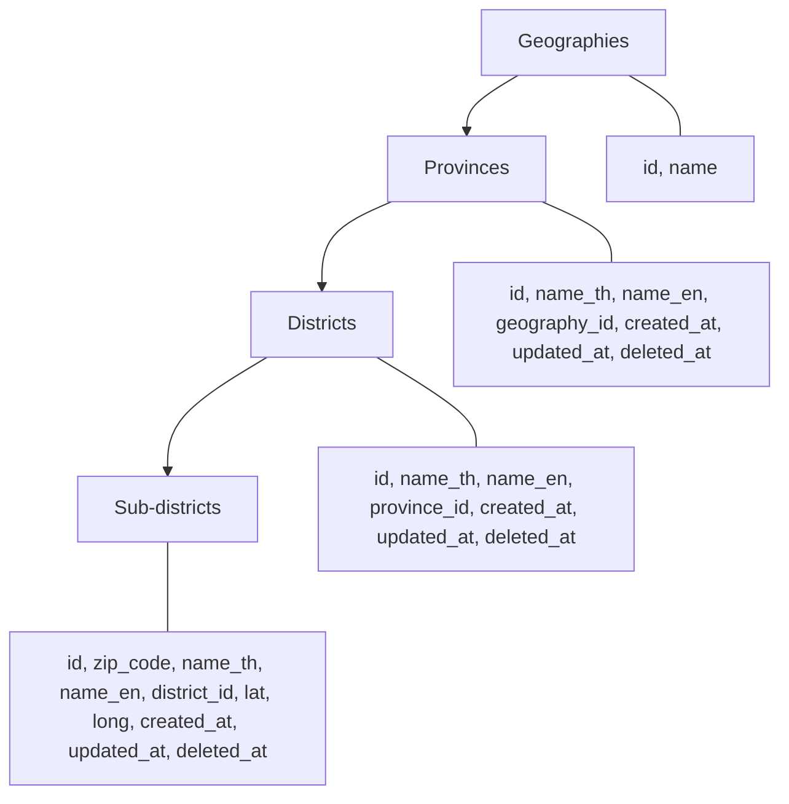

# Data Model Diagram

แผนภาพความสัมพันธ์ข้อมูล (Entity–Relationship Diagram, ERD)  
ครอบคลุมโครงสร้าง: **Geographies → Provinces → Districts → Sub-districts**

---

## 📊 ERD (Entity–Relationship Diagram)

---

## 🌳 Hierarchy View

โครงสร้างแบบลำดับชั้น (Hierarchy) ช่วยให้เห็นความเชื่อมโยงของข้อมูลจากบนลงล่าง

---

## 📖 Legend

- **PK** → Primary Key
- **FK** → Foreign Key
- เส้น `||--o{` = ความสัมพันธ์แบบ **One-to-Many (1..*)**

---

## 📝 หมายเหตุ

- ตาราง **geographies** เป็น root → provinces
- ตาราง **provinces** เชื่อมโยงกับ geographies ผ่าน `geography_id`
- ตาราง **districts** เชื่อมโยงกับ provinces ผ่าน `province_id`
- ตาราง **sub_districts** เชื่อมโยงกับ districts ผ่าน `district_id`
- ทุกตารางมี **timestamps** (`created_at`, `updated_at`, `deleted_at`) เพื่อรองรับการ track การเปลี่ยนแปลงข้อมูล

