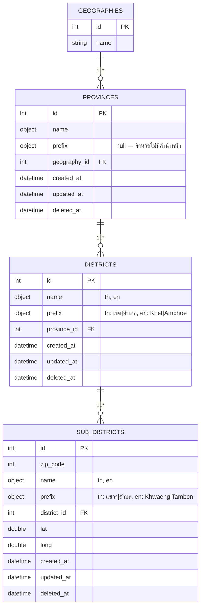

# Data Model Diagram

ERD high-level — field details in `data/spec/*.json` (source of truth) และ [schema.md](schema.md)

```mermaid
erDiagram
    GEOGRAPHIES {
        int id PK
        string name
    }
    PROVINCES {
        int id PK
        object name
        object prefix "null — จังหวัดไม่มีคำนำหน้า"
        int geography_id FK
        datetime created_at
        datetime updated_at
        datetime deleted_at
    }
    DISTRICTS {
        int id PK
        object name "th, en"
        object prefix "th: เขต|อำเภอ, en: Khet|Amphoe"
        int province_id FK
        datetime created_at
        datetime updated_at
        datetime deleted_at
    }
    SUB_DISTRICTS {
        int id PK
        int zip_code
        object name "th, en"
        object prefix "th: แขวง|ตำบล, en: Khwaeng|Tambon"
        int district_id FK
        double lat
        double long
        datetime created_at
        datetime updated_at
        datetime deleted_at
    }

    GEOGRAPHIES ||--o{ PROVINCES   : "1..*"
    PROVINCES     ||--o{ DISTRICTS : "1..*"
    DISTRICTS     ||--o{ SUB_DISTRICTS : "1..*"
```

**หมายเหตุ**: `name` และ `prefix` เป็น nested object `{th, en}` (v3). CSV/SQL/XLSX exports flatten เป็น `<field>_th` / `<field>_en` columns.
