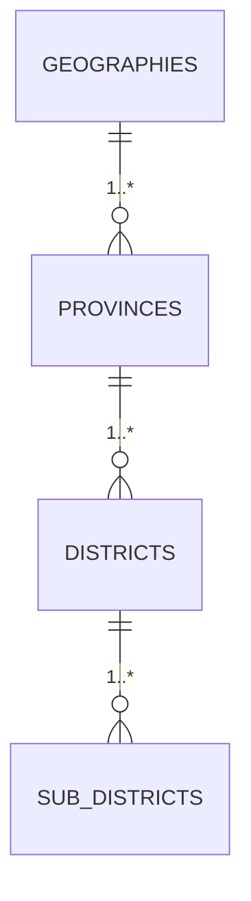

# Thai Province Data - Documentation

เอกสารประกอบสำหรับการใช้งานและการพัฒนาโปรเจกต์ **thai-province-data**

---

## 📖 Overview

โปรเจกต์นี้จัดทำชุดข้อมูลเชิงโครงสร้างของ **จังหวัด (Province), อำเภอ (District), ตำบล (Sub-district)** ของประเทศไทย  
พร้อมทั้งมีสคริปต์สำหรับตรวจสอบความถูกต้อง (validate) และ export ออกได้หลายรูปแบบ เช่น CSV, JSON, SQL, XLSX, XML  
รวมทั้ง API JSON ที่สามารถเรียกใช้งานได้ทันทีจาก GitHub

---

## 📂 โครงสร้างโฟลเดอร์ (สำคัญ)

- `data/raw/` — ข้อมูลต้นทางจากหน่วยงาน (ไฟล์ JSON array)
- `data/spec/` — ไฟล์ JSON Schema สำหรับตรวจสอบโครงสร้างข้อมูล
- `formats/` — export ไฟล์ในหลายรูปแบบ (csv, json, sql, xlsx, xml)
- `api/latest/` — ข้อมูล API JSON ที่ build ล่าสุด
- `scripts/` — สคริปต์ automation (validate, export formats, export api)
- `docs/` — เอกสาร schema, diagram, คู่มือ

---

## 🧾 Schema

รายละเอียดโครงสร้างข้อมูลและ JSON Schema สามารถดูได้ที่ [docs/schema.md](schema.md)
- **Geographies** → Provinces
- **Provinces** → Districts
- **Districts** → Sub-districts

---

## 🖼 Diagram

โครงสร้างความสัมพันธ์ (ERD) แสดงใน [docs/diagram.md](diagram.md)



---

## 🚀 การใช้งานข้อมูล

### 1. ใช้ API JSON โดยตรง
ไฟล์พร้อมใช้งานที่ `api/latest/` เช่น
- `province.json`
- `district.json`
- `sub_district.json`
- `province_with_district_and_sub_district.json`
- `sub_district_with_district_and_province.json`

**ตัวอย่างการเรียกใช้งาน**
```bash
curl -s https://raw.githubusercontent.com/kongvut/thai-province-data/refs/heads/master/api/latest/province.json | jq '.[0]'
```

### 2. ใช้ไฟล์ export
สามารถนำข้อมูลจาก `formats/` ไปใช้งานในระบบอื่น ๆ เช่น DB, Data Pipeline, Spreadsheet

ตัวอย่าง:
- **CSV** → ใช้โหลดเข้า Excel/Sheets ได้ง่าย
- **SQL** → มี CREATE TABLE + INSERT
- **XLSX** → ต้องติดตั้ง `pandas + openpyxl`
- **XML** → สำหรับระบบที่ต้องการโครงสร้าง XML
---

## 🤝 Contributing

- โปรดอ่าน [CONTRIBUTING.md](../CONTRIBUTING.md) ก่อนส่ง Pull Request
- ทุกการแก้ไขข้อมูลควรมี reference ที่ชัดเจน
- PR ที่ผ่านการ validate แล้วจะถูก review และ merge

---

## 📄 License

[MIT License](../LICENSE) © 2025 Kongvut Sangkla

